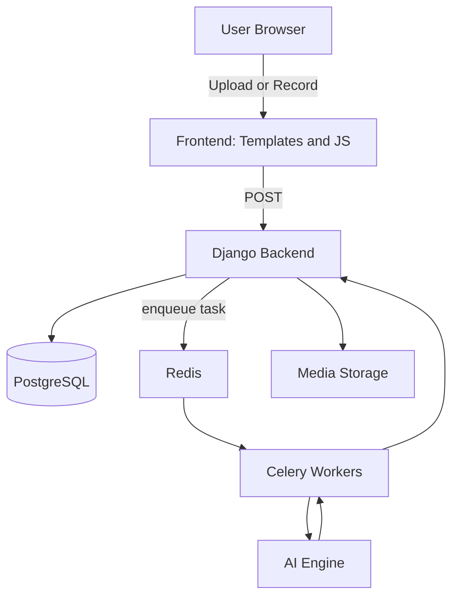

# SLAQ — Project Context & Overview

Updated project context & architecture document
- Focus: clear architecture, AI model flow, key files, dev + deployment notes
- Maintainer: SLAQ Research team
- Last updated: 2025-11-20

## Purpose
- SLAQ is a Django-based system for detecting stuttering events in recorded speech, computing severity metrics, and tracking progress over time for therapy.

## Audience
- Developers, ML engineers, clinicians reviewing model outputs, and ops engineers deploying the system.

## Scope
- Describe architecture, AI model pipeline, how models are loaded and invoked, key files to inspect, dev setup, endpoints, and testing guidance.

## Core architecture (high level)
- Monolithic Django backend serving pages and APIs; enqueues background analysis tasks.
- Celery workers perform AI tasks (transcription, event detection, post-processing).
- Redis is used as the broker; PostgreSQL stores metadata. Media files stored locally or on S3.

## Key components
- **Frontend**: templates + JS for recording UI, progress indicators, Chart.js visualizations.
- **Django Backend**: request handling, file upload/validation (`core/`, `diagnosis/`, `reports/`).
- **Celery Workers**: run long-running analysis tasks.
- **AI Engine**: model inference and analysis under `diagnosis/ai_engine/`.

## AI model pipeline (summary)
1. Upload/Record: user produces audio; backend saves file and creates an `AudioRecording` with status `pending`.
2. Enqueue: backend enqueues `diagnosis.tasks.analyze_recording(recording_id)`.
3. Worker: Celery worker processes the task, updates status to `processing` and loads the AI pipeline.
4. Preprocessing: resample to 16kHz mono, normalize, validate.
5. ASR: Wav2Vec2 (or configured model) transcribes audio.
6. Alignment & CTC: align outputs to find mismatches.
7. Stutter detection: heuristics/classifier mark repetitions, prolongations, blocks, interjections (`detect_stuttering.py`).
8. Postprocessing: compute metrics and persist `AnalysisResult` and `StutterEvent` records.
9. Notify: update DB and allow frontend to fetch results via APIs.

## Dev quick start
1. `python -m venv venv` then `venv\Scripts\activate` (Windows).
2. `pip install -r requirements.txt`.
3. `python manage.py migrate`.
4. Start Redis (Docker): `docker run -p 6379:6379 redis:latest`.
5. Start Celery (Windows dev): `celery -A slaq_project worker --pool=solo --loglevel=info`.
6. Run server: `python manage.py runserver`.

## Key files
- `diagnosis/ai_engine/model_loader.py` — model loading and device placement.
- `diagnosis/ai_engine/detect_stuttering.py` — detection logic.
- `diagnosis/ai_engine/utils.py` — audio preprocessing helpers.
- `diagnosis/tasks.py` — Celery orchestration.

## Important env vars
- `REDIS_URL`, `DATABASE_URL`, `MODEL_DEVICE` (`cpu`/`cuda`), `MEDIA_ROOT`, `MEDIA_URL`.

## API endpoints of interest
- `GET /record/` — record page
- `POST /recordings/upload/` — upload handler
- `GET /analyses/<id>/` — analysis page
- `GET /api/analyses/<id>/status/` — status JSON
- `GET /api/analyses/<id>/data/` — analysis payload JSON

## Testing notes
- Unit tests: focus on `diagnosis/ai_engine/utils.py`, `detect_stuttering.py`, and `tasks.py`.
- Integration tests: simulate upload → queue → worker (mock models).

## Security & privacy
- Validate uploads, limit size, enforce access controls for patient data, and use encrypted storage for production backups.

## Roadmap ideas
- Improve timestamp precision with forced-alignment tools.
- Add clinician editing and confidence-calibrated severity scoring.
- Add websocket notifications for real-time updates.

Last updated: 2025-11-20

## 📊 Key Metrics Tracked
- (Add metrics tracked by analyses here — e.g., stutter frequency, severity score, average processing time.)
